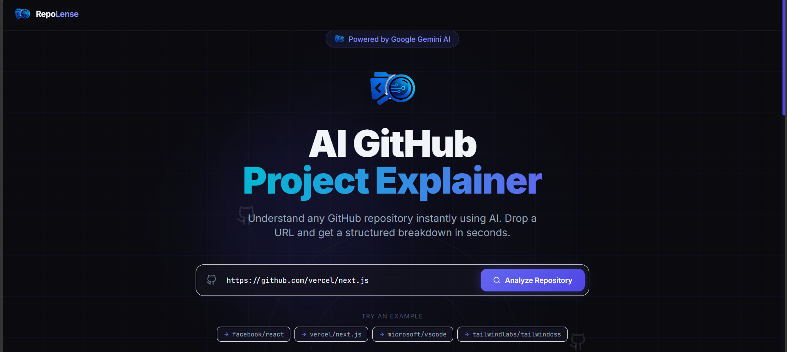
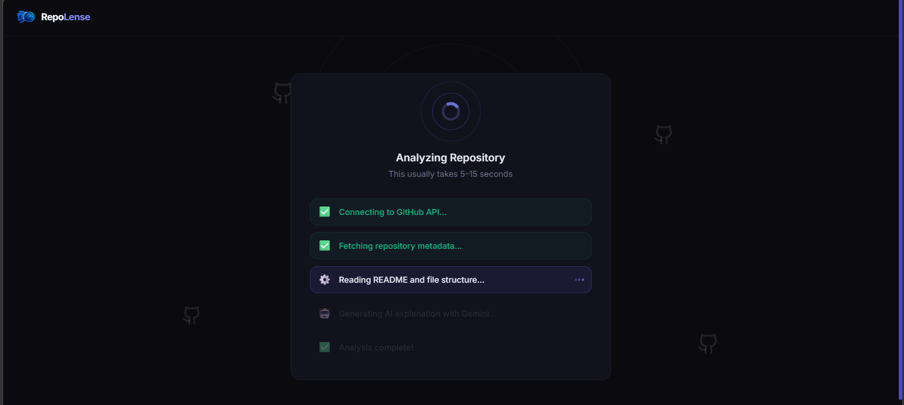
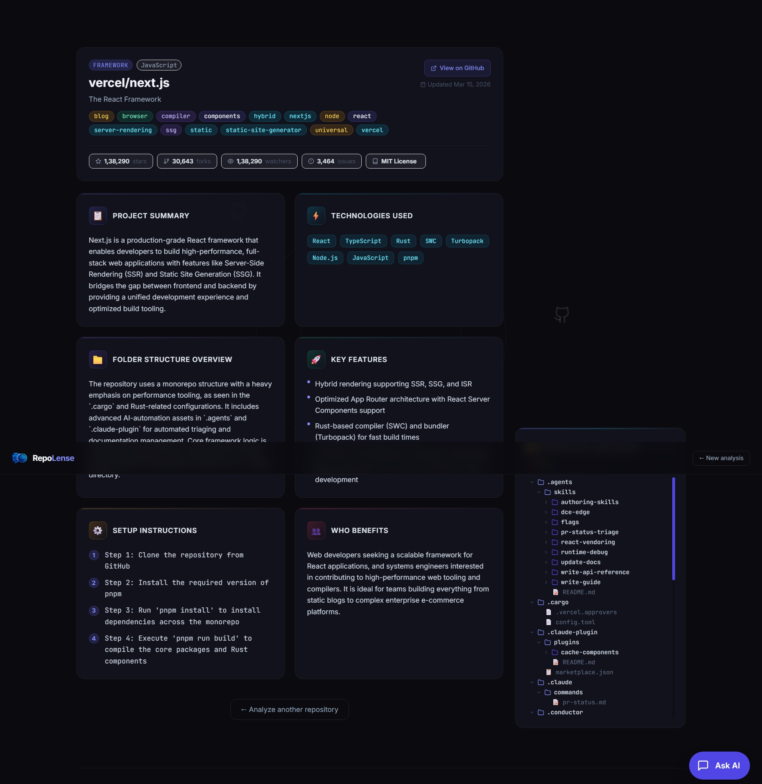

# 💎 RepoLense — AI GitHub Project Explainer

RepoLense is a modern, high-fidelity web application that allows developers to instantly understand any GitHub repository using advanced AI analysis. Optimized for speed and clarity, it breaks down complex codebases into structured insights, file trees, and actionable summaries.



## ✨ Features

- **🚀 Instant Repository Analysis**: Paste any GitHub URL and get a deep-dive summary in seconds.
- **🌀 Sequential Loading Experience**: A beautiful, multi-step animation sequence that guides you through the analysis (Connecting → Fetching → Analyzing).
- **📂 Interactive File Tree**: Explore the project's structure with a visual, color-coded file explorer.
- **💬 AI Chat Assistant**: Ask specific questions about the codebase (e.g., "How does authentication work?", "Where is the main entry point?") and get contextual answers.
- **🎨 Premium UI/UX**: Built with a sleek dark theme, glassmorphism effects, and dynamic floating background animations.



## 🛠️ Tech Stack

### Frontend
- **React 18** (Vite-powered)
- **Tailwind CSS** (Utility-first styling)
- **Framer Motion** (High-fidelity animations)
- **Lucide & React Icons** (Modern iconography)
- **Axios** (API communication)

### Backend
- **Node.js & Express** (Server architecture)
- **Google Gemini 3 Flash Preview** (Advanced AI analysis)
- **GitHub REST API** (Repository data fetching)
- **Dotenv** (Secret management)



## 🚀 Getting Started

### Prerequisites
- Node.js (v16+)
- A Google API Key ([Get it here](https://aistudio.google.com/app/apikey))
- A GitHub Personal Access Token.

### Installation

1. **Clone the Repository**
   ```bash
   git clone https://github.com/Deepak-kumar-kashyap/RepoLense.git
   cd RepoLense
   ```

2. **Backend Setup**
   ```bash
   cd Backend
   npm install
   ```
   Create a `.env` file in the `Backend` directory:
   ```env
   PORT=5000
   GEMINI_API_KEY=your_gemini_api_key_here
   GITHUB_TOKEN=your_github_token_here
   ```
   Start the backend:
   ```bash
   npm run dev
   ```

3. **Frontend Setup**
   ```bash
   cd ../Frontend
   npm install
   npm run dev
   ```

4. **Open the App**
   Navigate to `http://localhost:5173` and start analyzing!

## 📜 License
This project is licensed under the MIT License.

---
Built with ❤️ by RepoLense Team
